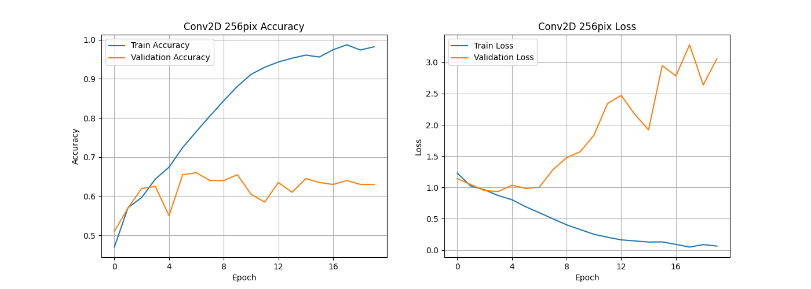
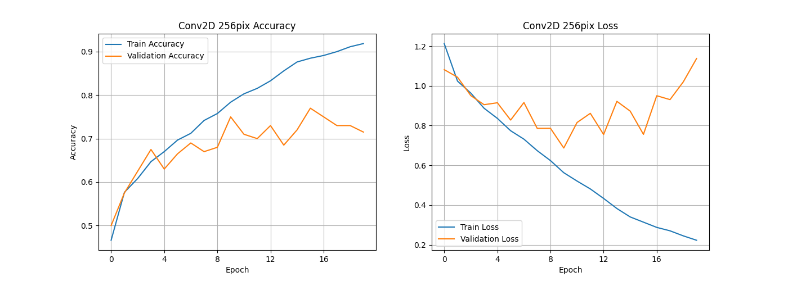

# 🍎🍌🍇🥭🍓 Capstone_Fruits_Classification

## Author

Matthew J. Lee 
BS/MS Mech/Aero Eng UC Davis, MBA Tepper, Tech Proj Mgmt UC Berkeley, ML & AI UC Berkeley 
Aerospace Engineer, Technical Project Manager, AI Computer Vision Engineer, Entrepreneur 
https://mattjlee.info

## Introduction

The goal of this capstone is to classify 10,000 pictures of 5 different fruits (apples, bananas, grapes, mangoes, strawberries). We explore multiple models (Conv2D/Maxpooling2D, MobileNetV2, EfficientNetV2B0, EfficientNetB7, ResNet152V2, InceptionV3, Xception, ConvNeXtBase) and then hypertune to report the best accuracy.

## Dataset

Kaggle dataset link: https://www.kaggle.com/datasets/utkarshsaxenadn/fruits-classification/

The fruits classification dataset is from Kaggle.  It contains 10,000 images with an even number (2,000 each) of 5 different types of fruits:
- apples
- bananas
- grapes
- mangoes
- strawberries

The pictures are of various shapes, sizes, colors, and lighting conditions.  Some are pictures taken with a camera, some are computer generated, and some are drawn by hand.  All types of scenes and angles are taken of the fruits, including whole, sliced, peeled, bitten, plucked, on the tree/ vine, and arranged on dishes.  Some pictures even have false colors (like a blue apple) or are in black-and-white.  What is consistent among these images is that the fruits are true to shape, meaning there's no mashed banana, apple sauce, grape juice, or other byproducts.  If there is a picture of a byproduct (e.g. strawberry cake), the fruit is there as well.  Some images are of the full fruit, some are in bunches, some are only partially on the image or some of the fruit is not exactly true to shape because it's dipped in chocolate or something similar. 

.png)
Hand drawn apple 
.jpeg)
Computer generated strawberry 
.jpeg)
Sliced and arranged apples 
.jpeg)
Blue apple 
.jpeg)
Strawberry cake 
.jpeg)
Chocolate dipped strawberries 
.jpeg)
Banana mostly out of the picture 

The pictures have varying dimensions but all are 96 dpi vertical and horizontal resolution, have 24 bit depth, and are in jpeg format.

The data is split into 97% training, 2% validation, and 1% testing.  Since there is a total of 10,000 pictures, this means that for each of the 5 fruit classes, there are 1940 training, 40 validation, and 20 testing images.  This ensures that distribution of classes is consistent across all three sets and that the model is trained on a representative sample.

## Modeling Plan

 We will use a baseline model made up of Conv2D/Maxpooling2D layers and 7 pre-trained models.  Pre-trained models summary:

 Model              | Gen / Year       | Input Size | Params (M) | ImageNet Top-1 Acc. | Speed / Size      | Best For                                 |
|--------------------|------------------|------------|------------|----------------------|-------------------|-------------------------------------------|
| MobileNetV2        | Classic / 2018   | 224×224    | ~3.4M      | ~71.8%               | Very fast, lightweight | Mobile, embedded, small datasets      |
| EfficientNetV2B0   | Next-Gen / 2021  | 224×224    | ~7.1M      | ~82.3%               | Fast, efficient    | Fast training, limited resources          |
| ResNet152V2        | Classic / 2016   | 224×224    | ~60.2M     | ~78.3%               | Slower, large      | Very deep, general-purpose                |
| EfficientNetB7     | Classic / 2019   | 600×600    | ~66M       | ~84.4%               | Heavy compute      | Max accuracy, strong GPU                  |
| InceptionV3        | Classic / 2015   | 299×299    | ~23.8M     | ~78.8%               | Medium             | Multi-scale features, strong all-arounder |
| Xception           | Classic / 2017   | 299×299    | ~22.9M     | ~79.0%               | Medium             | Depthwise separable convs, efficient      |
| ConvNeXtBase       | Next-Gen / 2022  | 224×224    | ~88M       | ~83.1%               | High memory usage  | Modern CNN rivaling ViT                   |

## Exploratory Data Analysis

### Image Resolutions

First we took a look at image resolutions, just so that we can be familiar with all of the different sizes and ranges.  For this, we plotted the heights and widths on frequency charts.

### Class Counts

First, we produced a table to make sure the #s align with what we expect.  All looks good.

| Category    | Train | Validation | Test | Total | Train % | Validation % | Test % |
|-------------|-------|------------|------|--------|----------|---------------|--------|
| Apple       | 1940  | 40         | 20   | 2000   | 97.0     | 2.0           | 1.0    |
| Banana      | 1940  | 40         | 20   | 2000   | 97.0     | 2.0           | 1.0    |
| Grape       | 1940  | 40         | 20   | 2000   | 97.0     | 2.0           | 1.0    |
| Mango       | 1940  | 40         | 20   | 2000   | 97.0     | 2.0           | 1.0    |
| Strawberry  | 1940  | 40         | 20   | 2000   | 97.0     | 2.0           | 1.0    |

Next, we generated a pie chart containing each fruit.  Perfect 20% for each fruit.

Finally, we generate bar chart counts to ensure each fruit has the proper # and %s for training, validation, and test data.  All looks good here as well.

## Modeling

### 🤖 Baseline Model (Conv2D, 256 px)

For the baseline model, we took a look at <i> [Deep Learning](https://www.amazon.com/Deep-Learning-Python-Francois-Chollet/dp/1617294438) </i> by Francois Chollet to assist with layers of Conv2D/Maxpooling2D.  

Model settings:
- batch size = 32
- image size = 256 x 256
- seed = 42
- optimizer = "Adam"
- loss = sparse_categorical_crossentropy
- dropout = none
- epochs = 20

Layers shown here:

| Layer (type)              | Output Shape           | Param #     |
|---------------------------|------------------------|-------------|
| rescaling (Rescaling)     | (None, 256, 256, 3)     | 0           |
| conv2d (Conv2D)           | (None, 256, 256, 32)    | 896         |
| max_pooling2d (MaxPool2D) | (None, 128, 128, 32)    | 0           |
| conv2d_1 (Conv2D)         | (None, 128, 128, 64)    | 18,496      |
| max_pooling2d_1           | (None, 64, 64, 64)      | 0           |
| conv2d_2 (Conv2D)         | (None, 64, 64, 128)     | 73,856      |
| max_pooling2d_2           | (None, 32, 32, 128)     | 0           |
| conv2d_3 (Conv2D)         | (None, 32, 32, 256)     | 295,168     |
| max_pooling2d_3           | (None, 16, 16, 256)     | 0           |
| conv2d_4 (Conv2D)         | (None, 16, 16, 256)     | 590,080     |
| max_pooling2d_4           | (None, 8, 8, 256)       | 0           |
| flatten (Flatten)         | (None, 16384)           | 0           |
| dense (Dense)             | (None, 512)             | 8,389,120   |
| dense_1 (Dense)           | (None, 5)               | 2,565       |
 Total params: 9,370,181 (35.74 MB)
 Trainable params: 9,370,181 (35.74 MB)
 Non-trainable params: 0 (0.00 B)

The resulting training and validation accuracies and losses are shown below:

#### 🤖👀 Baseline Model Insights

- The model is clearly subject to overfitting.  The evidence is at epoch = 2. At these locations:
  - the Validation Accuracy hits a plateua
  - Train Accuracy passes up Validation Accuracy at subsequent epochs
  - Validation Loss begins increasing rapidly  
- The Validation Accuracy hits a plateau starting at Epoch 2 and has a value of 62%.  Not a very good result. 

#### 🤖✅ Baseline Model Actionable Items
Let's try an input shape of 128 pixels and Dropout(0.5) and see if that improves overfitting.

### 🤖➕ Revised Baseline Model (Conv2D, 128 px, dropout = 0.5)

Model settings:
- batch size = 32
- **image size = 128 x 128**
- seed = 42
- optimizer = "Adam"
- loss = sparse_categorical_crossentropy
- **dropout = 0.5**
- epochs = 20

Layers:

| Layer (type)             | Output Shape           | Param #     |
|--------------------------|------------------------|-------------|
| rescaling_1 (Rescaling)  | (None, 128, 128, 3)     | 0           |
| conv2d_5 (Conv2D)        | (None, 128, 128, 32)    | 896         |
| max_pooling2d_5          | (None, 64, 64, 32)      | 0           |
| conv2d_6 (Conv2D)        | (None, 64, 64, 64)      | 18,496      |
| max_pooling2d_6          | (None, 32, 32, 64)      | 0           |
| conv2d_7 (Conv2D)        | (None, 32, 32, 128)     | 73,856      |
| max_pooling2d_7          | (None, 16, 16, 128)     | 0           |
| conv2d_8 (Conv2D)        | (None, 16, 16, 256)     | 295,168     |
| max_pooling2d_8          | (None, 8, 8, 256)       | 0           |
| conv2d_9 (Conv2D)        | (None, 8, 8, 256)       | 590,080     |
| max_pooling2d_9          | (None, 4, 4, 256)       | 0           |
| flatten_1 (Flatten)      | (None, 4096)            | 0           |
| dropout (Dropout)        | (None, 4096)            | 0           |
| dense_2 (Dense)          | (None, 512)             | 2,097,664   |
| dense_3 (Dense)          | (None, 5)               | 2,565       |
 Total params: 3,078,725 (11.74 MB)
 Trainable params: 3,078,725 (11.74 MB)
 Non-trainable params: 0 (0.00 B)

 Accuracies and Loss:

 

 #### 🤖➕👀 Revised Baseline Model Insights
- decreasing to 128 pixels and adding Dropout(0.5) reduced overfitting
- the Validation Accuracy only peaked at around 75%, still not a good result

### 🍖 Backbone (Pre-trained) Models

We run each model in a loop with the following settings:
- batch size = 32
- image size = 256 x 256
- seed = 42
- trainable = False
- optimizer = Adam
- loss = sparse_categorical_crossentropy
- dropout = 0.5
- epochs = 20

We end up with this summary table:

| Model            | Max Train Accuracy | Median Train Accuracy | Max Val Accuracy | Median Val Accuracy | Training Time (min) |
|------------------|--------------------|------------------------|------------------|----------------------|----------------------|
| MobileNetV2      | 0.8703             | 0.8628                 | 0.920            | 0.8950               | 4.80                 |
| EfficientNetV2B0 | 0.2214             | 0.2100                 | 0.260            | 0.2175               | 5.02                 |
| ResNet152V2      | 0.8778             | 0.8680                 | 0.905            | 0.8800               | 10.70                |
| EfficientNetB7   | 0.2174             | 0.2061                 | 0.260            | 0.2125               | 17.73                |
| InceptionV3      | 0.8657             | 0.8569                 | 0.905            | 0.8925               | 4.89                 |
| Xception         | 0.8882             | 0.8808                 | 0.905            | 0.8800               | 6.09                 |
| ConvNeXtBase     | 0.7812             | 0.7703                 | 0.810            | 0.7925               | 15.09                |

and these accuracy and loss plots:

#### 🍖👀 Backbone Models Insights
- No overfitting
  - All of the models had Validation Accuracy at or above Training Accuracy, so we aren't concerned about overfitting
- Median valitation accuracy
 - The best metric for evaluating these models is the **Median Validation Accuracy**
 - As we saw before, the Training Accuracy can be subject to overfitting, so Validation Accuracy is more appropriate
 - Since the Validation Accuracies show plateus, the median values will tell the best story of what the model delivers consistently
 - The **highest median Training Accuracy** was achieved with **MobileNetV2** with a value of **90%**
   -  **MobileNetV2** had a **maximum Validation Accuracy of 92%**
 - Not far behinda are InceptionV3, Xception, and Resnet152V2 with median Training Accuracies of 89.5%, 88.5%, and 88.5%, respectively
 - The poorest models were the EfficientNet variants (EfficientNetV2B0 and EfficienNetB7) which hovered around median Validation Accuracy = 21%
- Training time
 - All of the models trained at around 5 minutes, except EfficientNetB7 took about 8 1/2 minutes.
- Some burning questions we will try to answer next:
 - Why were EfficientNet models so poor?
   - All of the models were trained on imagenet, which has 20 fruit classes.  4/5 fruit classes overlap with this Kaggle dataset: bananas, apples, strawberries, and mangoes (grapes are missing).  
     - So, why isn't the accuracy 4/5 or 80%?
       - Let's create a Confusion Matrix to see what is happening
 - Why was EfficientNetB7 so slow compared to the other backbones?
   - EfficientNetB7 is setup to use larger images (600 x 600) than the other models and is trained on more parameters.

#### 🍖✅  Backbone Models Actionable Items
- Hypertuning for the best model: MobileNetV2
- Test models with training = True
- Investigate poor (~20%) accuracies for EfficientNet
 - Confusion Matrix
 - View some examples of mis-labeled fruits

### 🛠️📱 Hypertuning for MobileNet

Hypertuning was performed on MobileNetV2 with hyperparameters dropout, units, and learning rate tuned.  Settings
- batch size = 32
- image size = 256 x 256
- seed = 42
- trainable = False
- optimizer = Adam
 - learning rate = [1e-2, 1e-3, 1e-4, 1e-5] 
- loss = sparse_categorical_crossentropy
- dropout = [ 0.3, 0.4, 0.5, 0.6, 0.7]
- units = [64, 128, 192, 256, 320, 384, 448, 512]
- epochs = 20

The tuned MobileNetV2 model reached **96% test accuracy** with hyperparameters:
- dropout = 0.3
- units = 384
- learning rate = 0.0001

Accuracy and loss plots:

#### 🛠️📱👀 Hypertuning for MobileNet Insights
- a **96% test accuracy score** was achieved
- a large dropout was not necessary, 0.3 was optimal
- 384 units was optimal, I was expecting 256 since it is closest to the 224 input size for MobileNet
- the optimal learning rate of 1e-4 was interesting and I did not know what to expect.  A more refined learning rate would probably have eventually been better, but I limited epochs to 50, so perhaps 1e-5 would have been better at a larger epoch limit.

### 🍖💪 Backbone Models with Training On

Settings:
- batch size = 32
- image size = 256 x 256
- seed = 42
- **trainable = True**
- optimizer = Adam
- loss = sparse_categorical_crossentropy
- dropout = 0.5
- epochs = 20

  

