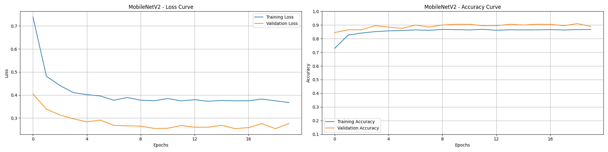
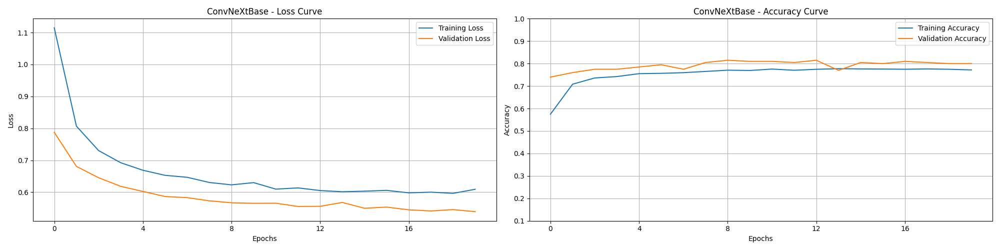

# 🍎🍌🍇🥭🍓 Capstone_Fruits_Classification

## Author

Matthew J. Lee 
BS/MS Mech/Aero Eng UC Davis, MBA Tepper, Tech Proj Mgmt UC Berkeley, ML & AI UC Berkeley 
Aerospace Engineer, Technical Project Manager, AI Computer Vision Engineer, Robotics Engineer, Entrepreneur 
https://mattjlee.info

## Introduction

The goal of this capstone is to classify 10,000 pictures of 5 different fruits (apples, bananas, grapes, mangoes, strawberries). We explore multiple models (Conv2D/Maxpooling2D, MobileNetV2, EfficientNetV2B0, EfficientNetB7, ResNet152V2, InceptionV3, Xception, ConvNeXtBase) and then hypertune to report the best accuracy.

Link to this notebook: https://github.com/mjlee177/Capstone_Fruits_Classification

## Dataset

Kaggle dataset link: https://www.kaggle.com/datasets/utkarshsaxenadn/fruits-classification/

The fruits classification dataset is from Kaggle.  It contains 10,000 images with an even number (2,000 each) of 5 different types of fruits:
- 🍎 Apples
- 🍌 Bananas
- 🍇 Grapes
- 🥭 Mangoes
- 🍓 Strawberries

The pictures are of various shapes, sizes, colors, and lighting conditions.  Some are pictures taken with a camera, some are computer generated, and some are drawn by hand.  All types of scenes and angles are taken of the fruits, including whole, sliced, peeled, bitten, plucked, on the tree/ vine, and arranged on dishes.  Some pictures even have false colors (like a blue apple) or are in black-and-white.  What is consistent among these images is that the fruits are true to shape, meaning there's no mashed banana, apple sauce, grape juice, or other byproducts.  If there is a picture of a byproduct (e.g. strawberry cake), the fruit is there as well.  Some images are of the full fruit, some are in bunches, some are only partially on the image or some of the fruit is not exactly true to shape because it's dipped in chocolate or something similar. 

.png)
Hand drawn apple 
.jpeg)
Computer generated strawberry 
.jpeg)
Sliced and arranged apples 
.jpeg)
Blue apple 
.jpeg)
Strawberry cake 
.jpeg)
Chocolate dipped strawberries 
.jpeg)
Banana mostly out of the picture 

The pictures have varying dimensions but all are 96 dpi vertical and horizontal resolution, have 24 bit depth, and are in jpeg format.

The data is split into 97% training, 2% validation, and 1% testing.  Since there is a total of 10,000 pictures, this means that for each of the 5 fruit classes, there are 1940 training, 40 validation, and 20 testing images.  This ensures that distribution of classes is consistent across all three sets and that the model is trained on a representative sample.

## Business Case

The results of this study can provide insights into real world cases where fruits categorization is important.  Fruits identification could be used to improve grocery store checkouts, train robots to handle fruits, or sorting fruits at a warehouse, grocery store, or farm.

## Modeling Plan

 🔢 We will use a baseline model made up of Conv2D/Maxpooling2D layers and 7 pre-trained models.  Pre-trained models summary:

 Model              | Gen / Year       | Input Size | Params (M) | ImageNet Top-1 Acc. | Speed / Size      | Best For                                 |
|--------------------|------------------|------------|------------|----------------------|-------------------|-------------------------------------------|
| MobileNetV2        | Classic / 2018   | 224×224    | ~3.4M      | ~71.8%               | Very fast, lightweight | Mobile, embedded, small datasets      |
| EfficientNetV2B0   | Next-Gen / 2021  | 224×224    | ~7.1M      | ~82.3%               | Fast, efficient    | Fast training, limited resources          |
| ResNet152V2        | Classic / 2016   | 224×224    | ~60.2M     | ~78.3%               | Slower, large      | Very deep, general-purpose                |
| EfficientNetB7     | Classic / 2019   | 600×600    | ~66M       | ~84.4%               | Heavy compute      | Max accuracy, strong GPU                  |
| InceptionV3        | Classic / 2015   | 299×299    | ~23.8M     | ~78.8%               | Medium             | Multi-scale features, strong all-arounder |
| Xception           | Classic / 2017   | 299×299    | ~22.9M     | ~79.0%               | Medium             | Depthwise separable convs, efficient      |
| ConvNeXtBase       | Next-Gen / 2022  | 224×224    | ~88M       | ~83.1%               | High memory usage  | Modern CNN rivaling ViT                   |

## Conclusions

| Model            | Max Train Accuracy | Median Train Accuracy | Max Val Accuracy | Median Val Accuracy | Training Time (min) |
|------------------|--------------------|------------------------|------------------|----------------------|----------------------|
| MobileNetV2      | 0.8684             | 0.8640                 | 0.910            | 0.900                | 5.00                 |
| EfficientNetV2B0 | 0.2177             | 0.2126                 | 0.270            | 0.205                | 5.21                 |
| ResNet152V2      | 0.8773             | 0.8695                 | 0.895            | 0.880                | 5.23                 |
| EfficientNetB7   | 0.2120             | 0.2070                 | 0.250            | 0.215                | 8.41                 |
| InceptionV3      | 0.8607             | 0.8578                 | 0.915            | 0.895                | 4.90                 |
| Xception         | 0.8905             | 0.8822                 | 0.915            | 0.885                | 4.99                 |
| ConvNeXtBase     | 0.7774             | 0.7706                 | 0.815            | 0.800                | 5.55                 |

- A simple baseline model made up of Conv2D/Maxpool2D layers resulted in a maximum validation accuracy of 75%
- MobileNetV2 performed the best (90% median validation accuracy) among the 7 models, although ResNet152V2, InceptionV3, and Xception were within 2%
- After hypertuning the dropout, units, and learning rates for MobileNetV2, a **test accuracy of 96%** was achieved
- Turning training on resulted in overfitting, as the validation accuracy greatly underperformed the training accuracy in most cases.  Up to 20 epochs, the validation accuracies were still not good for most models
- We investigated why EfficientNet stalled at ~20% validation accuracy, but no conclusions were made after reviewing the confusion matrix and a few misclassified images

## Next Steps

- Further investigations can be made into why EfficientNet (with training off) and Xception (with training on) models stalled at 20% validation accuracy
  - Adjust image pixels and re-run models
  - Deeper look into the layers in the models
  - Deeper look into the calculations in the models
  - Review more examples of misclassification

## 1. Exploratory Data Analysis

### 1.1 Image Resolutions

First we took a look at image resolutions, just so that we can be familiar with all of the different sizes and ranges.  For this, we plotted the heights and widths on frequency charts.

### 1.2 Class Counts

🔢 First, we produced a table to make sure the #s align with what we expect.  All looks good.

| Category    | Train | Validation | Test | Total | Train % | Validation % | Test % |
|-------------|-------|------------|------|--------|----------|---------------|--------|
| Apple       | 1940  | 40         | 20   | 2000   | 97.0     | 2.0           | 1.0    |
| Banana      | 1940  | 40         | 20   | 2000   | 97.0     | 2.0           | 1.0    |
| Grape       | 1940  | 40         | 20   | 2000   | 97.0     | 2.0           | 1.0    |
| Mango       | 1940  | 40         | 20   | 2000   | 97.0     | 2.0           | 1.0    |
| Strawberry  | 1940  | 40         | 20   | 2000   | 97.0     | 2.0           | 1.0    |

Next, we generated a pie chart containing each fruit.  Perfect 20% for each fruit.

Finally, we generate bar chart counts to ensure each fruit has the proper # and %s for training, validation, and test data.  All looks good here as well.

## 2. Modeling

### 2.1 🤖 Baseline Model (Conv2D, 256 px)

For the baseline model, we took a look at <i> [Deep Learning](https://www.amazon.com/Deep-Learning-Python-Francois-Chollet/dp/1617294438) </i> by Francois Chollet to assist with layers of Conv2D/Maxpooling2D.  

Model settings:
- Batch size = 32
- Image size = 256 x 256
- Seed = 42
- Optimizer = "Adam"
- Loss = sparse_categorical_crossentropy
- Dropout = none
- Epochs = 20

Layers shown here:

| Layer (type)              | Output Shape           | Param #     |
|---------------------------|------------------------|-------------|
| rescaling (Rescaling)     | (None, 256, 256, 3)     | 0           |
| conv2d (Conv2D)           | (None, 256, 256, 32)    | 896         |
| max_pooling2d (MaxPool2D) | (None, 128, 128, 32)    | 0           |
| conv2d_1 (Conv2D)         | (None, 128, 128, 64)    | 18,496      |
| max_pooling2d_1           | (None, 64, 64, 64)      | 0           |
| conv2d_2 (Conv2D)         | (None, 64, 64, 128)     | 73,856      |
| max_pooling2d_2           | (None, 32, 32, 128)     | 0           |
| conv2d_3 (Conv2D)         | (None, 32, 32, 256)     | 295,168     |
| max_pooling2d_3           | (None, 16, 16, 256)     | 0           |
| conv2d_4 (Conv2D)         | (None, 16, 16, 256)     | 590,080     |
| max_pooling2d_4           | (None, 8, 8, 256)       | 0           |
| flatten (Flatten)         | (None, 16384)           | 0           |
| dense (Dense)             | (None, 512)             | 8,389,120   |
| dense_1 (Dense)           | (None, 5)               | 2,565       |
 Total params: 9,370,181 (35.74 MB)
 Trainable params: 9,370,181 (35.74 MB)
 Non-trainable params: 0 (0.00 B)

#### 2.1.1 🤖📈📉 The baseline model training and validation losses and accuracies are shown below:

#### 2.1.2 🤖👀 Baseline Model Insights

- The model is clearly subject to overfitting.  The evidence is at epoch = 2. At these locations:
  - The Validation Accuracy hits a plateua
  - Train Accuracy passes up Validation Accuracy at subsequent epochs
  - Validation Loss begins increasing rapidly  
- The Validation Accuracy hits a plateau starting at Epoch 2 and has a value of 62%.  Not a very good result.

#### 2.1.3 🤖✅ Baseline Model Actionable Items
Let's try an input shape of 128 pixels and Dropout(0.5) and see if that improves overfitting.

### 2.2 🤖➕ Revised Baseline Model (Conv2D, 128 px, dropout = 0.5)

Model settings:
- Batch size = 32
- **Image size = 128 x 128** - changed
- Seed = 42
- Optimizer = "Adam"
- Loss = sparse_categorical_crossentropy
- **Dropout = 0.5** - changed
- Epochs = 20

Layers:

| Layer (type)             | Output Shape           | Param #     |
|--------------------------|------------------------|-------------|
| rescaling_1 (Rescaling)  | (None, 128, 128, 3)     | 0           |
| conv2d_5 (Conv2D)        | (None, 128, 128, 32)    | 896         |
| max_pooling2d_5          | (None, 64, 64, 32)      | 0           |
| conv2d_6 (Conv2D)        | (None, 64, 64, 64)      | 18,496      |
| max_pooling2d_6          | (None, 32, 32, 64)      | 0           |
| conv2d_7 (Conv2D)        | (None, 32, 32, 128)     | 73,856      |
| max_pooling2d_7          | (None, 16, 16, 128)     | 0           |
| conv2d_8 (Conv2D)        | (None, 16, 16, 256)     | 295,168     |
| max_pooling2d_8          | (None, 8, 8, 256)       | 0           |
| conv2d_9 (Conv2D)        | (None, 8, 8, 256)       | 590,080     |
| max_pooling2d_9          | (None, 4, 4, 256)       | 0           |
| flatten_1 (Flatten)      | (None, 4096)            | 0           |
| dropout (Dropout)        | (None, 4096)            | 0           |
| dense_2 (Dense)          | (None, 512)             | 2,097,664   |
| dense_3 (Dense)          | (None, 5)               | 2,565       |
 Total params: 3,078,725 (11.74 MB)
 Trainable params: 3,078,725 (11.74 MB)
 Non-trainable params: 0 (0.00 B)

#### 2.2.1 🤖➕📈📉 Revised Baseline Model, Losses and Accuracies:

 

 #### 2.2.2 🤖➕👀 Revised Baseline Model Insights
- Decreasing to 128 pixels and adding Dropout(0.5) reduced overfitting
- The Validation Accuracy only peaked at around 75%, still not a good result

### 2.3 🍖 Backbone (Pre-trained) Models

We run each model in a loop with the following settings:
- Batch size = 32
- Image size = 256 x 256
- Seed = 42
- Trainable = False
- Optimizer = Adam
- Loss = sparse_categorical_crossentropy
- Dropout = 0.5
- Epochs = 20

#### 2.3.1 🍖🔢 Backbone Models Results Summary Table:

| Model            | Max Train Accuracy | Median Train Accuracy | Max Val Accuracy | Median Val Accuracy | Training Time (min) |
|------------------|--------------------|------------------------|------------------|----------------------|----------------------|
| MobileNetV2      | 0.8684             | 0.8640                 | 0.910            | 0.900                | 5.00                 |
| EfficientNetV2B0 | 0.2177             | 0.2126                 | 0.270            | 0.205                | 5.21                 |
| ResNet152V2      | 0.8773             | 0.8695                 | 0.895            | 0.880                | 5.23                 |
| EfficientNetB7   | 0.2120             | 0.2070                 | 0.250            | 0.215                | 8.41                 |
| InceptionV3      | 0.8607             | 0.8578                 | 0.915            | 0.895                | 4.90                 |
| Xception         | 0.8905             | 0.8822                 | 0.915            | 0.885                | 4.99                 |
| ConvNeXtBase     | 0.7774             | 0.7706                 | 0.815            | 0.800                | 5.55                 |

#### 2.3.2 🍖📈📉 Backbone Models, Loss and Accuracy Plots:

#### 2.3.3 🍖👀 Backbone Models Insights

- No overfitting
  - All of the models had Validation Accuracy at or above Training Accuracy, so we aren't concerned about overfitting
- Median valitation accuracy
  - The best metric for evaluating these models is the **Median Validation Accuracy**
  - As we saw before, the Training Accuracy can be subject to overfitting, so Validation Accuracy is more appropriate
  - Since the Validation Accuracies show plateus, the median values will tell the best story of what the model delivers consistently
  - The **highest median Training Accuracy** was achieved with **MobileNetV2** with a value of **90%**
    -  **MobileNetV2** had a **maximum Validation Accuracy of 92%**
  - Not far behinda are InceptionV3, Xception, and Resnet152V2 with median Validaion Accuracies of 89.5%, 88.5%, and 88.0%, respectively
  - The poorest models were the EfficientNet variants (EfficientNetV2B0 and EfficienNetB7) which hovered around median Validation Accuracy = 21%
- Training time
 - All of the models trained at around 5 minutes, except EfficientNetB7 took about 8 1/2 minutes.
- Some burning questions we will try to answer next:
 - Why were EfficientNet models so poor?
  - All of the models were trained on imagenet, which has 20 fruit classes.  4/5 fruit classes overlap with this Kaggle dataset: bananas, apples, strawberries, and mangoes (grapes are missing).  
     - So, why isn't the accuracy 4/5 or 80%?
       - Let's create a Confusion Matrix to see what is happening
       - Let's also look at some mis-classification cases to visualize results
 - Why was EfficientNetB7 so slow compared to the other backbones?
   - EfficientNetB7 is setup to use larger images (600 x 600) than the other models and is trained on more parameters (no further analysis needed)

#### 2.3.4 🍖✅  Backbone Models Actionable Items

- Hypertuning for the best model: MobileNetV2
- Test models with training = True
- Investigate poor (~20%) accuracies for EfficientNet
 - Confusion Matrix
 - View some examples of mis-labeled fruits

### 2.4 🛠️📱 Hypertuning for MobileNet

Hypertuning was performed on MobileNetV2 with hyperparameters dropout, units, and learning rate tuned.  Settings
- Batch size = 32
- Image size = 256 x 256
- Seed = 42
- Trainable = False
- Optimizer = Adam
 - **Learning rate = [1e-2, 1e-3, 1e-4, 1e-5]** - changed
- Loss = sparse_categorical_crossentropy
- **Dropout = [ 0.3, 0.4, 0.5, 0.6, 0.7]** - changed
- **Units = [64, 128, 192, 256, 320, 384, 448, 512]** - changed
- Epochs = 20

The tuned MobileNetV2 model reached **96% test accuracy** with hyperparameters:
- Dropout = 0.3
- Units = 384
- Learning rate = 0.0001

#### 2.4.1 🛠️📱📈📉 Hypertuned MobileNet, Loss and Accuracy Plots:

#### 2.4.2 🛠️📱🔢 Hypertuned MobileNet, Metrics Table: Precision, Recall, F1-Score

| Class       | Precision | Recall | F1-Score | Support |
|-------------|-----------|--------|----------|---------|
| Apple       | 1.0000    | 0.8500 | 0.9189   | 20      |
| Banana      | 1.0000    | 1.0000 | 1.0000   | 20      |
| Grape       | 0.9524    | 1.0000 | 0.9756   | 20      |
| Mango       | 0.8696    | 1.0000 | 0.9302   | 20      |
| Strawberry  | 1.0000    | 0.9500 | 0.9744   | 20      |

#### 2.4.3 🛠️📱🔢 Hypertuned MobileNet, Confusion Matrix

#### 2.4.4 🛠️📱❌📷 Hypertuned MobileNet, Misclassified Images

#### 2.4.5 🛠️📱👀 Hypertuning for MobileNet Insights

- A **96% test accuracy score** was achieved
 - A large dropout was not necessary, 0.3 was optimal
 - 384 units was optimal, I was expecting 256 since it is closest to the 224 input size for MobileNet
 - The optimal learning rate of 1e-4 was interesting and I did not know what to expect.  A more refined learning rate would probably have eventually been better, but I limited epochs to 50, so perhaps 1e-5 would have been better at a larger epoch limit
 - I considered building in an early stop after 5 epochs if validation accuracy was not showing improvement, but ultimately I decided I wanted more data (no early stop)
- Metrics Table
  - The entire model only missed 4 of the 100 images, so all of the metrics are extremely good
  - Accuracy is probably still the best metric to determine success, but under some scenario where false positives are costly, precision would be best.  Similarly, if the cost of false negatives was high, recall would be best.  F1 is not particularly important in this scenario since the dataset is perfectly balanced
- Misclassified Images
  - From observing the misclassified images, it's reasonable why they why they would be identified incorrectly
   - The first picture is peeled apple so it would be hard for even a human to tell which fruit it is
   - The second image has apples at angles that make them seem sort of oblong, similar to mangoes
   - The third picture has apples at strange angles again, making them seem longer
   - The fourth picture has strawberries piled up, which may resemble the shape of a bunch of grapes

## 3. Extra Investigations

### 3.1 🍖💪 Backbone Models with Training On

The purposes of this excercise are: 
- To see if having training on will fix the low validation accuracies
- For visualization of the difference between training off and on
  - If we happen to get a better result with training on, we can optimize that model and call it our new "best"

Settings:
- Batch size = 32
- Image size = 256 x 256
- Seed = 42
- **Trainable = True** - changed
- Optimizer = Adam
- Loss = sparse_categorical_crossentropy
- Dropout = 0.5
- Epochs = 20

#### 3.1.1 🍖💪🔢 Backbones with Training Off/ On, Summary Tables

Training Off
| Model            | Max Train Accuracy | Median Train Accuracy | Max Val Accuracy | Median Val Accuracy | Training Time (min) |
|------------------|--------------------|------------------------|------------------|----------------------|----------------------|
| MobileNetV2      | 0.8684             | 0.8640                 | 0.910            | 0.900                | 5.00                 |
| EfficientNetV2B0 | 0.2177             | 0.2126                 | 0.270            | 0.205                | 5.21                 |
| ResNet152V2      | 0.8773             | 0.8695                 | 0.895            | 0.880                | 5.23                 |
| EfficientNetB7   | 0.2120             | 0.2070                 | 0.250            | 0.215                | 8.41                 |
| InceptionV3      | 0.8607             | 0.8578                 | 0.915            | 0.895                | 4.90                 |
| Xception         | 0.8905             | 0.8822                 | 0.915            | 0.885                | 4.99                 |
| ConvNeXtBase     | 0.7774             | 0.7706                 | 0.815            | 0.800                | 5.55                 |

Training On

| Model            | Max Train Accuracy | Median Train Accuracy | Max Val Accuracy | Median Val Accuracy | Training Time (min) |
|------------------|--------------------|------------------------|------------------|----------------------|----------------------|
| MobileNetV2      | 0.9709             | 0.9427                 | 0.765            | 0.4650               | 8.55                 |
| EfficientNetV2B0 | 0.9860             | 0.9690                 | 0.375            | 0.2050               | 6.84                 |
| ResNet152V2      | 0.9625             | 0.8659                 | 0.790            | 0.7025               | 15.02                |
| EfficientNetB7   | 0.9826             | 0.9718                 | 0.695            | 0.2150               | 26.21                |
| InceptionV3      | 0.9769             | 0.9364                 | 0.895            | 0.8200               | 7.04                 |
| Xception         | 0.9890             | 0.9706                 | 0.925            | 0.8850               | 8.90                 |
| ConvNeXtBase     | 0.2046             | 0.1997                 | 0.200            | 0.2000               | 37.63                |

#### 3.1.2 🍖💪🔢👀 Backbones with Training Off/ On, Table Insights

 - All **median validation accuracies are higher** for the **training off** models, except Xception, which is 0.5% higher
 - This is due to the **training off models** being able to **generalize better** since they've been trained on 1,000 different categories and 14M images
 - Even with **training on**, the EffiecientNet median validation accuracy was stuck around 20%.  Actually, ConvNeXtBase became a new victim to the same phenomenon
   - We will take a closer look at EfficientNet and try to see why this happens with a Confusion Matrix
 - As expected, with **training on**, the training time goes up for every model.  It takes longer to train all layers from scratch.

#### 3.1.3 🍖💪📈📉 Backbone Models with Training Off/On, Loss and Accuracy

MobileNetV2
 
EfficientNetV2B0
 
ResNet152V2
 
EfficientNetB7
 
InceptionV3
 
Xception
 
ConvNeXtBase
 

#### 3.1.4 🍖💪📈📉👀 Backbones with Training Off/On, Loss and Accuracy Insights

 - You can really see the benefit of leaving **training off** from **where the validation accuracy** starts at the very first epoch.  For **training off** (top charts), every validcation accuracy line gets a head start (epoch = 0) at a higher value.
 - Overfitting was present in the **training on** cases
 - As was pointed out previously, for **training on** EfficientNet and ConvNeXtBase only reached ~20% accuracies
 - With **training on**, the Training Accuracies consistenly reached higher final values (except ConvNeXtBase), showing these models' capability to train better to the given data with **training on**

### 3.2 ⚡ A Closer Look int EfficientNet

We want to investigate why EfficientNet models were stuck around 20% validation accuracy.

We adjust the settings so that the image size is the ideal 224 for EfficientNetV2B0.  Settings:
- Batch size = 32
- **Image size = 224 x 224** - changed
- Seed = 42
- Trainable = False
- Optimizer = Adam
- Loss = sparse_categorical_crossentropy
- Dropout = 0.5
- Epochs = 20

#### 3.2.1 EfficientNetV2B0 Confusion Matrix

#### 3.2.2 ⚡❌📷 EfficientNetV2B0 Misclassified Images Examples

#### 3.2.3 EfficientNetV2B0 Insights

- **Conclusion: the confusion matrix gives us more information, but there is no story as to why the EfficientNet model mis-categorized items.  A deeper look into the exact original training pictures and matching them to passed/ failed matches in this analysis is warranted, but out-of-scope for this paper**
- Values shown are for the last epoch = 20.  We expect validation accuracy = 23.5%
- The values along top-left to bottom-right diagonal are the ones that the model got correct
- 3 grapes, 20 mangos, and 24 strawberries were correct, 47 total
- The total validation set is 40 per fruit x 5 fruits = 200
- For this result we are getting 47/200 or 23.5%
- Though we can now see the exact mislabelings, it's not particularly helpful with generating a story
  - The model predicted 0 apples and 0 bananas
  - The model predicted 10 grapes, 3 were correct
    - Since grapes were not in the original training dataset I expected it to predict 0, but that is not the case
  - The model predicted 80 mangoes, 20 of which were correct
  - The model predicted 110 strawberries, 17 of which were correct
- Mislabeled fruits pictures
 - I can see that maybe the prediction of grape from what really is a mango could be because these mangos are in bunches, similar to grapes
 - Looking at bananas predicted to be stawberries - I really have no clue, except maybe the outlines of grouped up bananas  are shaped similar to a strawberry
